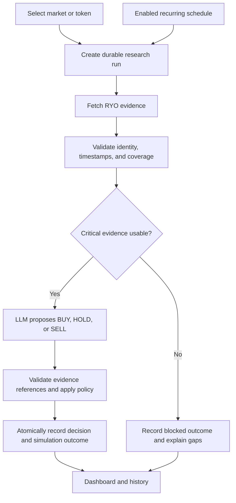
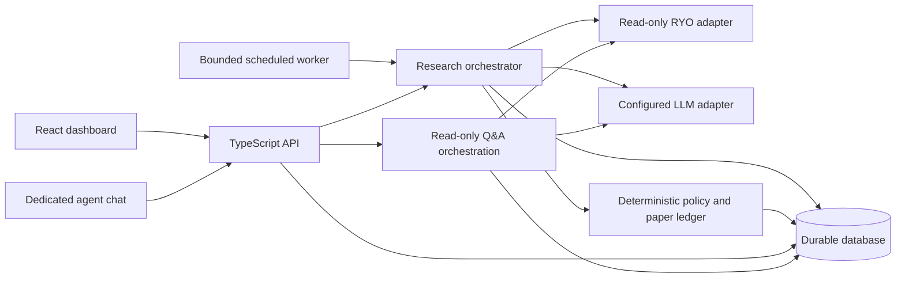

# TradeSense

### Analyse → Reason → Predict → Simulate → Visualize

**RYO-CHAN Hackathon 2026 · Track 01: Autonomous Agents · Track 02: Dashboards & Interfaces**

TradeSense is a proposed AI crypto-market analyst that scans markets, interprets evidence, explains a BUY / HOLD / SELL decision, and records the practice trade it would make. One dashboard connects market changes to the agent's explanation and simulated portfolio impact. A dedicated agent chat section lets users ask questions about the market and data derived from RYO-CHAN, with evidence-linked answers and follow-up questions.

> User chooses market/token → RYO tools fetch data → AI agent analyzes evidence → simulated decision → dashboard explains why

**Status — September 23, 2026: documentation only.** This workspace contains the project plan, [coding-agent instructions](AGENTS.md), and [action history](HISTORY.md). Application code, integrations, scripts, tests, and deployment do not exist yet. Everything below, including agent chat, is an implementation proposal unless explicitly marked otherwise.

The track descriptions and RYO tool names come from the user's brief. Official eligibility, deadlines, submission requirements, tool schemas, supported networks, provider access, and model availability have not been independently verified. This document makes no claim about those details. Verify them with official event and provider documentation before implementation or submission.

## Contents

- [Problem and product](#problem-and-product)
- [Track fit and acceptance criteria](#track-fit-and-acceptance-criteria)
- [Scope](#scope)
- [Workflow and architecture](#workflow-and-architecture)
- [RYO integration](#ryo-integration)
- [Agent decisions and evidence](#agent-decisions-and-evidence)
- [Simulation contract](#simulation-contract)
- [Dashboard](#dashboard)
- [Agent chat](#agent-chat)
- [Storage and recovery](#storage-and-recovery)
- [Proposed stack and layout](#proposed-stack-and-layout)
- [API contract](#api-contract)
- [Setup contract](#setup-contract)
- [Build milestones](#build-milestones)
- [Verification and troubleshooting](#verification-and-troubleshooting)
- [Demo and submission](#demo-and-submission)
- [Limitations and next steps](#limitations-and-next-steps)
- [Reference provenance](#reference-provenance)

## Problem and product

Crypto research is scattered across market metrics, price charts, token details, and safety checks. A signal alone does not tell a viewer what changed, how reliable the evidence is, or what action follows.

TradeSense ties these together in a single research run. A viewer should understand **what changed, why it matters, what the agent decided, and what prevented a trade** within 30 seconds.

Example journey:

> “Analyze this token, compare it with another candidate, explain the risks, and show the trade you would simulate.”

“Predict” means a time-bounded, uncertain outlook with an invalidation condition. It does not mean a guaranteed price target or a claim of profitable trading. The visible reasoning trail is a concise evidence-linked explanation, tool history, and policy outcome—not a transcript of private model deliberation.

## Track fit and acceptance criteria

| Track from the brief | TradeSense contribution | Evidence to demonstrate |
|---|---|---|
| 01 — Autonomous Agents | RYO research, LLM analysis, policy checks, durable practice-trade records | One complete run linking tool results to a decision and ledger event; replay and recovery without duplicate trades |
| 02 — Dashboards & Interfaces | Prioritized market overview, token cards, charts, risk, explanation, decision history, and dedicated agent chat | A viewer identifies the latest change, decision, supporting evidence, and risk within 30 seconds, then asks evidence-grounded follow-up questions |

Project acceptance gates, not independently verified judging rules:

- [ ] A market scan and a selected-token analysis use verified live RYO integrations.
- [ ] Safety and comparison results are integrated; unavailable capabilities are explicitly disclosed.
- [ ] Every completed decision cites persisted evidence and includes contrary evidence or missing information.
- [ ] The simulation can demonstrate BUY, HOLD, and SELL with deterministic, testable accounting.
- [ ] A stale or incomplete critical input prevents execution and shows the reason.
- [ ] Refresh, retry, concurrency, and restart cannot apply a simulated trade twice.
- [ ] Dashboard summary, chart data, explanation, and history all identify the same run and data mode.
- [ ] A dedicated chat section answers market and RYO-derived-data questions with source timestamps, evidence links, and persistent follow-up context.
- [ ] Chat distinguishes retrieved facts, derived calculations, and AI interpretation; missing or stale data is explicit, and chatting never applies a simulated trade.
- [ ] A user can enable and stop bounded recurring scans, with cadence and last/next run visible.
- [ ] One fresh setup and one complete browser journey are verified before claiming a working MVP.

## Scope

### Must ship

One research agent, one selected market/network initially, a bounded token watchlist, one paper portfolio per demo session, and one dashboard with a dedicated agent chat section. Chat uses the same research tools and model adapter. Start with manual analysis and market Q&A, then add an opt-in recurring worker after persistence and recovery work.

The agent gathers market evidence, evaluates a token and its safety, compares candidates when requested, produces a structured decision, passes it through deterministic simulation rules, and saves the result. The UI presents market overview, analysis cards, price/volume charts, risk status, AI explanation, simulated decision, portfolio, prior decisions, and a conversational market-research area.

### Deferred

Real orders, wallet signing, deposits, swaps, leverage, shorts, derivatives, copy trading, multi-agent swarms, paid subscriptions, broad multi-chain support, and predictive-model training. Historical backtesting is separate from replaying a saved run and is deferred until timestamp and data coverage requirements are defined.

No trading keys or wallet connection are required. Real execution is outside this product's MVP scope.

## Workflow and architecture





The server owns orchestration, provider credentials, validated data, policy, and ledger writes. The browser renders authoritative run records. A failed live dependency must never cause an automatic switch to fixture data.

## RYO integration

These are tool names supplied in the brief, **not verified SDK signatures**:

| Tool | Intended role | Evidence to preserve |
|---|---|---|
| `scan_market` | Discover candidates and overview changes | Universe, filters, timestamp, ranking inputs, coverage |
| `analyze_token` | Inspect one token's market behavior | Stable token identity, metrics, units, price basis, observation times |
| `check_safety` | Identify available risk flags | Findings, severity, source, coverage, unavailable checks |
| `compare_tokens` | Compare selected candidates on the same basis | Token identities, matching periods/units, comparative metrics |

Before writing an adapter, verify official access instructions, transport, authentication, request/response schemas, network coverage, rate limits, and errors. Do not assume REST, MCP, or an npm package until confirmed. Use the smallest real read-only call as the integration gate.

Normalize observations into evidence records containing an ID, run ID, tool, sanitized parameters, token/network identity, source timestamp, retrieval timestamp, units, normalized values, data mode, and a redacted raw-response reference/hash. Preserve failures and missing fields. A missing value is not zero; missing safety coverage is not a clean bill of health.

Use network plus contract/mint address where available; a ticker alone is ambiguous. Compare only compatible currencies and windows. Do not compare a 24-hour change with a 1-hour change as though they were equivalent.

Apply bounded timeouts, retries with backoff, caching with explicit expiry, and request limits. Cache hits retain original observation times. If RYO does not supply historical candles, explicitly show that limitation or verify and disclose an additional read-only data source; do not fabricate a chart from summary metrics.

## Agent decisions and evidence

Use one configurable reasoning adapter initially. Gemini and Big Pickle are candidates named by the user; exact provider identity, endpoint, model ID, structured-output support, access, and costs must be checked before selecting either. Do not assume an OpenAI-compatible endpoint or interchangeable SDKs.

The LLM receives only normalized evidence and bounded context. It proposes the research decision; ordinary code validates evidence references, enforces policy, and sizes any simulated order.

| Decision field | Contract |
|---|---|
| `runId`, `tokenId`, `asOf` | Server-issued run, canonical token, evidence cutoff |
| `action` | `BUY`, `HOLD`, or `SELL` |
| `summary` | Short explanation of the decision |
| `supportingEvidence`, `counterEvidence` | Evidence IDs with concise interpretations |
| `risks`, `missingData` | Known flags, uncertainty, unavailable checks |
| `outlook` | Directional scenario, explicit horizon, invalidation condition |
| `confidence` | Low/medium/high evidence-strength label; not a calibrated probability |
| `model`, `promptVersion`, `policyVersion` | Reproducibility metadata |
| `policyOutcome` | Allowed/blocked, reason codes, and simulation outcome |

Validate every model output against a strict schema. Reject invented evidence IDs, nonfinite numbers, unexpected actions, and claims unsupported by the supplied evidence. One bounded repair attempt may be used; persistent invalid output yields a failed run, not a fabricated HOLD.

HOLD is a valid completed research decision. `BLOCKED` and `FAILED` describe run or policy outcomes. Preserve the proposed action when policy blocks it, but show “No simulated trade” prominently. Do not rewrite an unavailable analysis into an apparent successful HOLD.

Store the exact evidence snapshot, sanitized model request, model response, prompt/policy versions, generation settings, and simulation parameters. Replaying the saved decision through the same policy should reproduce ledger calculations. Rerunning a hosted LLM may produce a different answer; label that a new analysis rather than deterministic replay.

## Simulation contract

All balances, orders, fills, and returns are **simulated**. The initial product uses a long-only, unleveraged portfolio in one quote currency. These are proposed demo defaults, not investment recommendations:

| Parameter | Initial proposal |
|---|---|
| Starting cash | 10,000 virtual USD |
| BUY size | At most 5% of pre-trade equity per eligible decision |
| Per-token exposure | At most 20% of pre-trade equity after the proposed fill |
| SELL size | Entire available position for that token |
| Fee | 10 basis points of fill notional |
| Adverse slippage | 10 basis points on reference price |
| Execution reference freshness | At most 60 seconds old at simulation time |
| Recurring cadence | Proposed 5 minutes, subject to verified provider quotas |

Version these defaults and display active values. Recompute affordability including fees; round quantities down to supported precision. Reduce a BUY to available cash and exposure capacity, or skip with a reason if no valid quantity remains. SELL without holdings records `SKIPPED_NO_POSITION`. HOLD creates no fill and charges no fee.

For positive quantity `q`, reference price `p`, slippage fraction `s`, and fee fraction `f`:

- BUY fill price: `p × (1 + s)`; cash decreases by `q × fillPrice × (1 + f)`.
- SELL fill price: `p × (1 - s)`; cash increases by `q × fillPrice × (1 - f)`.
- BUY cost basis includes its fee. SELL realized P&L equals net sale proceeds minus the removed weighted-average cost basis.
- Unrealized P&L uses the latest explicitly timestamped mark; missing marks make valuation incomplete. Never silently value an unpriced holding at zero.

Use decimal arithmetic or scaled integers with explicit precision, not binary floating-point money calculations. Reject invalid prices, negative quantities, insufficient balances, unsupported tokens, and mismatched quote currencies.

Critical analysis and safety freshness windows must be configured after confirming source update cadence. Missing required windows, stale prices, unresolved high-severity safety findings, or insufficient safety coverage block simulated execution. This initial policy blocks both buys and sells when critical inputs fail; it does not pretend an unsafe or unpriced token could be sold.

Use only information observed by the decision cutoff. If a fresh execution reference is needed after analysis, store it separately with its timestamp and revalidate policy. The fill is a hypothetical quote-based assumption, not proof of exchange liquidity or execution. A run may end with a decision but a skipped trade when the execution quote is stale.

## Dashboard

Prioritize the latest change and its consequence over a wall of metrics:

| Area | Content |
|---|---|
| Header | Selected market/token, LIVE or FIXTURE label, as-of time, run control, schedule status |
| Decision summary | BUY/HOLD/SELL, trade applied/skipped/blocked, top reasons, strongest risk |
| Market overview | Supported universe, price/volume changes, candidate ranking and coverage |
| Token cards | Identity, price, change window, volume, liquidity when available, evidence links |
| Charts | Timestamped price/volume, explicit units/time range, simulated-fill markers |
| Safety panel | Findings, source, age, coverage, unknown/unavailable status |
| AI explanation | Supporting and contrary evidence, outlook, invalidation, uncertainty |
| Agent chat | Dedicated conversation area for market questions, RYO-derived insights, cited answers, and follow-ups |
| Paper portfolio | Virtual cash, holdings, realized/unrealized P&L, fees, valuation completeness |
| History drawer | Prior runs, decision changes, tool trace, policy version, simulation records |

Show “Changed since previous comparable run” with measured deltas and the evidence behind a changed decision. The comparison must use the same token identity, data mode, and compatible metric periods; otherwise explain why comparison is unavailable.

Support loading, partial data, no results, stale data, blocked analysis, provider errors, and completed runs. Keep the previous completed result visible with its timestamp while a new run is pending. Never mix a new chart with an old explanation without labeling both runs.

Use accessible contrast, keyboard navigation, readable mobile layouts, and text/icons alongside risk colors. A chart must have a textual summary. Expose detailed evidence on demand so the main screen remains understandable in 30 seconds.

## Agent chat

Dedicate a clearly labeled **Ask TradeSense** section of the webapp to conversational research. It should be accessible from the dashboard as a persistent panel or tab, with a full-width view on smaller screens. Include a message history, input box, suggested questions, selected market/token context, and visible LIVE/FIXTURE and freshness labels.

Example questions:

- “What changed in the market over the last 24 hours?”
- “What does RYO data show about this token's price and volume?”
- “Compare these two tokens and explain the main differences.”
- “Which safety flags were found, and which checks are unavailable?”
- “Why did the agent choose HOLD in this analysis?”
- “What evidence would change that outlook?”

The intended chat flow is:

1. Accept a question with explicit market/token context and, optionally, a selected prior run. Resolve ambiguous token names before fetching data.
2. Retrieve the user's permitted saved evidence. For current-market questions, fetch missing or stale information through the verified read-only RYO tools within configured limits. For questions about an earlier decision, use that decision's saved snapshot and label any newer comparison separately.
3. Generate a concise answer that distinguishes source observations, calculated metrics, and AI interpretation. Ground market-specific claims in persisted evidence; derived numbers must retain their inputs, units, time window, and calculation method.
4. Validate citations and save the answer, evidence references, tool activity, and model/prompt metadata. Show clickable evidence details with source and observation time, plus limitations or uncertainty.
5. Preserve context for follow-ups. Make a token, network, run, or data-mode change explicit instead of silently answering about the previous selection.

General explanations such as “What is trading volume?” may be answered as educational context and labeled accordingly; they must not be presented as a current RYO finding. If a requested fact is absent, unsupported, or inaccessible, say what is missing. Old data may support a clearly labeled historical answer, never a claim to know the current market.

Chat performs research only. It may explain an existing BUY/HOLD/SELL decision or link to the separate analysis/simulation flow, but sending a message must not create fills, change balances, enable schedules, or modify policy. Chat fetches persist evidence under a separate research record with `purpose=chat`; they never enter the simulation application's `APPLYING` stage.

Use the same server-side model/RYO adapters, session checks, data-mode separation, and provider budgets as the rest of the product. Bound message length, conversation context, tool calls, output size, and concurrent requests. Market text and chat messages cannot override tool permissions. Validate cited evidence against the conversation owner's accessible records and render responses without executable HTML.

Persist conversations and messages so refresh restores the discussion. Each answer records its own context and evidence snapshot; a later refresh must not rewrite old answers with new prices. Display pending, fetching, answering, complete, insufficient-data, and failed states. Retrying a message uses the same idempotency key and retrieves or resumes its persisted operation; do not create duplicate messages or repeat a completed provider call. An ambiguous interrupted provider call must be surfaced rather than blindly repeated.

## Storage and recovery

| Entity | Minimum persisted content |
|---|---|
| Sessions / portfolios | Ownership, data mode, initial cash, current ledger version |
| Runs | Input, idempotency key, request hash, mode, status, timestamps, cutoff, lease |
| Evidence / tool calls | Parameters, source, observation/retrieval times, values, duration, errors |
| Decisions | Validated proposal, rationale, evidence links, model/prompt/policy versions |
| Ledger events / fills | Run/decision ID, quantity, price, fees, cash and position deltas |
| Schedules | Owner, token/watchlist, enabled flag, cadence, next slot, lease and limits |
| Chat conversations / messages | Ownership, mode, ordered messages, per-message token/network/run context, idempotency key/input hash, status, answer, evidence citations, model/prompt metadata |
| Chat research / tool calls | `purpose=chat`, message ID, evidence snapshots, derived calculation inputs/methods, tool parameters/status/timestamps, usage and errors; no ledger application |

Run states: `QUEUED → FETCHING → ANALYZING → APPLYING → COMPLETED`, with explicit `BLOCKED`, `FAILED`, and `CANCELLED` outcomes. A completed run includes its simulation result even if no fill occurred.

Enforce a unique session/idempotency key and reject a changed body under the same key with `409`. Enforce one simulation application per decision. Use a database transaction and portfolio lock/version check for the ledger and completion record; retries must return the existing result.

Persist the decision before applying its trade. After a restart, resume from saved state rather than re-asking the model or duplicating ledger writes. Expired worker leases allow recovery. Keep external calls outside long-lived database transactions.

For recurring scans, use one durable job per schedule/time slot, prevent overlapping runs for the same portfolio, cap watchlist size and provider/model calls, and expose pause/stop. Disabling a schedule prevents new jobs; cancellation before application must win atomically against a trade commit. Browser polling alone is not autonomous scheduling.

Separate fixture and live portfolios and conversations. Resetting a demo creates a new portfolio rather than deleting its audit trail. Session ownership protects runs, schedules, portfolios, conversations, messages, and their evidence; a record ID is not authentication. Conversation mode is fixed at creation. Bound retained chat history with a documented retention policy while preserving evidence references for retained answers.

## Proposed stack and layout

Use one TypeScript workspace to keep agent and UI contracts aligned. This is a starting design choice; package versions and runtime compatibility remain to be verified.

| Area | Proposal |
|---|---|
| Web | React, Vite, TypeScript; a focused chart library, with D3 only where useful |
| Server | Node.js, TypeScript, Express; orchestrator and scheduled worker |
| Shared contracts | Zod schemas, types, pure policy and simulation calculations |
| Persistence | SQLite with migrations for a single-process demo and durable local storage |
| Model | One verified provider adapter, initially selected from the user's candidates |
| Tests | Vitest for policy/integration; Playwright for the core dashboard journey |

```text
apps/
  web/                  # Dashboard and agent chat; proposed port 5173
  server/               # API, research/Q&A orchestration, scheduler; proposed port 4000
packages/
  core/                 # Shared schemas, policy, decimal accounting
  adapters/             # Verified RYO and model integrations
data/
  fixtures/             # Synthetic evidence and expected outcomes
migrations/             # Versioned database schema
docs/                   # Verified integration notes and demo evidence
AGENTS.md
HISTORY.md
README.md
```

Only the three root Markdown files exist today. SQLite deployment requires a persistent writable volume and one supported writer topology. If hosting requires multiple instances or ephemeral storage, select durable PostgreSQL and adapt migrations before deployment; do not silently lose the ledger on redeploy.

## API contract

These are proposed application routes, not RYO endpoints:

| Route | Purpose |
|---|---|
| `GET /api/health` | Non-secret readiness and data mode |
| `GET /api/market` | Latest persisted market snapshot with age and coverage |
| `POST /api/runs` | Validate token/market selection, optional comparison, and idempotency key; enqueue run |
| `GET /api/runs/:id` | Owned run, evidence, decision, and simulation status |
| `GET /api/history` | Paginated owned runs with mode/token filters |
| `GET /api/portfolio` | Owned paper portfolio and timestamped valuation |
| `POST /api/schedules` | Create a bounded recurring analysis schedule |
| `PATCH /api/schedules/:id` | Enable, pause, or change an owned schedule within server limits |
| `POST /api/runs/:id/cancel` | Cancel pending work before simulation application |
| `POST /api/chat/conversations` | Create an owned conversation with fixed data mode and initial market/token context |
| `GET /api/chat/conversations` | List the session's conversations with pagination |
| `GET /api/chat/conversations/:id` | Retrieve owned context and paginated messages, statuses, and evidence references |
| `POST /api/chat/conversations/:id/messages` | Accept a bounded question, explicit context and optional run reference, plus idempotency key; enqueue research-only Q&A |

The server generates authoritative IDs and enforces limits. Return structured errors `{ code, message, requestId, retryable }`. Keep secrets and stack traces out of responses. Poll persisted state first; streaming is optional polish. Chat submission returns the persisted message/operation ID and status; poll the conversation to retrieve completion. Enforce conversation ownership and validate linked run/evidence access. Reusing a message idempotency key with different text or context returns `409`.

## Setup contract

**Do not run these commands yet: no package manifest, lockfile, environment template, or scripts exist.** When implementation is requested, scaffold the workspace, pin a compatible Node version and dependencies, create migrations, and implement the following interface.

| Command to implement | Expected behavior |
|---|---|
| `npm ci` | Install from the committed lockfile after its initial creation |
| `npm run doctor` | Validate redacted configuration and local storage readiness; no inference |
| `npm run db:migrate` | Apply versioned schema changes without deleting history |
| `npm run dev` | Start web and API; schedules run only when explicitly enabled |
| `npm run lint` / `npm run typecheck` | Static checks |
| `npm test` | Offline policy, accounting, persistence, and adapter fixture checks |
| `npm run test:e2e` | Browser journey against isolated fixture data |
| `npm run smoke:live` | Bounded real RYO/model research run and paper-only simulation |
| `npm run replay -- --run-id <id>` | Verify saved policy/accounting in isolation; no portfolio mutation |
| `npm run build` / `npm run start` | Build and start the supported deployment |

Create a placeholder-only `.env.example` during scaffolding. Proposed application settings:

```dotenv
DATA_MODE=fixture
PORT=4000
WEB_ORIGIN=http://localhost:5173
DATABASE_PATH=./data/tradesense.sqlite
LLM_PROVIDER=REPLACE_WITH_VERIFIED_PROVIDER
LLM_MODEL=REPLACE_WITH_VERIFIED_MODEL_ID
LLM_API_KEY=REPLACE_LOCALLY
SIM_INITIAL_CASH=10000
SIM_FEE_BPS=10
SIM_SLIPPAGE_BPS=10
SIM_MAX_BUY_EQUITY_BPS=500
SIM_MAX_TOKEN_EXPOSURE_BPS=2000
SIM_MAX_PRICE_AGE_SECONDS=60
SCHEDULER_ENABLED=false
SCAN_INTERVAL_SECONDS=300
```

RYO transport/authentication settings, critical evidence freshness windows, watchlist/call limits, and session configuration must be added after their contracts are verified. Do not invent a provider URL or secret name as though it were official. Fixture mode uses explicit local adapters and performs no model or RYO requests; live mode rejects missing or placeholder configuration.

Load server configuration explicitly. Never place provider credentials in browser-exposed `VITE_*` variables, logs, screenshots, or committed files. Protect hosted model usage with session ownership, rate limits, and operator-configured cost/request caps. Live research may incur provider fees even though all trades are simulated; use configured access and spending authorization.

## Build milestones

This is an ordered build plan, not a claim about the event's deadline.

| Milestone | Deliverable | Completion gate |
|---|---|---|
| 1 — Verify and scaffold | Official integration notes, workspaces, schemas, database, fixtures | One real read-only RYO response understood; offline app starts |
| 2 — Research path | RYO adapter, model adapter, saved evidence and decision | One live selected-token run with valid evidence citations |
| 3 — Simulation | Policy, decimal accounting, transactional ledger, recovery | BUY/HOLD/SELL and duplicate/restart cases pass |
| 4 — Dashboard and chat | Overview, cards, charts, risk, explanation, portfolio/history, and dedicated market Q&A | Full browser journey; 30-second comprehension review; cited chat answer and contextual follow-up survive refresh |
| 5 — Autonomy and hardening | Bounded recurring worker, pause/cancel, rate limits | Durable schedule and no overlapping/double-applied run |
| 6 — Demo readiness | Fresh setup, live evidence, failure demo, deployment plan | Rehearsed demo and accurate limitations |

Prove the data integration before expanding the UI. If a tool is unavailable, preserve the limitation and revise scope transparently. Cut animations, extra pages, and advanced chart controls before evidence provenance, accurate accounting, or recovery.

## Verification and troubleshooting

Required behavioral checks during implementation:

- Stale/missing evidence, wrong token identity, mixed metric windows, and unknown safety coverage.
- Tool failures, quota responses, invalid model output, invented citations, and prompt injection in market text.
- Cash/quantity precision, fees/slippage, exposure caps, zero holdings on SELL, and incomplete valuation.
- Same request retry, changed input under an existing key, concurrent portfolio updates, and restart after decision persistence.
- Schedule overlap, disabling/cancelling near application, and live/fixture data separation.
- UI loading/error states, keyboard use, consistent run IDs, and a BUY → HOLD → SELL fixture journey.
- Chat evidence citations, derived calculations, follow-up context, token changes, historical versus current answers, and missing/stale-data responses.
- Chat ownership isolation, prompt injection, safe rendering, usage limits, duplicate-message/restart recovery, and proof that chat cannot write the paper ledger or enable schedules.
- A separately identified live smoke run using real RYO data and the selected model, without real orders.

| Symptom | Check first | Correct behavior |
|---|---|---|
| Empty market view | Actual provider coverage, parameters, quota, mode | Show no data or error; preserve prior snapshot with age |
| Missing chart | Candle availability, units, timestamps | Show unavailable; never invent candles |
| Decision cannot be parsed | Model output and schema validation | Bounded repair, then explicit failure |
| BUY blocked | Evidence age, safety coverage, cash, exposure | Show the specific policy reason |
| Duplicate simulated fill | Idempotency, unique constraints, transaction boundary | Stop application and fix ledger correctness |
| Portfolio disappears after restart | Database path, migrations, durable volume | Recover persisted state; never silently reinitialize cash |

Offline tests establish application behavior, not live RYO compatibility or predictive accuracy. Record exact verification outcomes in HISTORY.md.

## Demo and submission

Suggested three-minute narrative, subject to official event rules:

1. **0:00–0:30:** Select a token and explain the two-track product.
2. **0:30–1:15:** Run analysis; reveal source timestamps, safety coverage, and comparison evidence.
3. **1:15–2:00:** Show the decision, opposing evidence, and the resulting paper trade or block.
4. **2:00–2:30:** Ask the chat “Why HOLD?” and open its cited evidence; show the saved decision history and replay result without duplicate fills.
5. **2:30–3:00:** Show schedule controls, an unavailable/stale-data state, and limitations.

Use clearly labeled fixtures to demonstrate specific edge cases; do not present them as live research. Keep a genuine live-run recording if access permits.

- [ ] Verify official deadline, eligibility, both-track submission rules, video format, and required RYO usage.
- [ ] Record actual app/repository/demo URLs only after they exist.
- [ ] Preserve tested commit, dependency versions, tool/schema references, model ID, prompt and policy versions.
- [ ] Document reused code, licenses, AI assistance, setup prerequisites, and provider access costs.
- [ ] Keep simulation labels and data timestamps visible in screenshots and recordings.
- [ ] Confirm hosted storage durability and worker availability before promising continuous scans.

## Limitations and next steps

TradeSense is a research and simulation prototype. Safety checks have limited coverage; model explanations can be wrong; a quote-based paper fill does not model real liquidity, routing, latency, or execution. Paper returns do not establish future performance. The project is not financial advice.

The next implementation step is to verify the official RYO interface and choose one accessible model provider, then scaffold a single-token end-to-end path. Later work can add broader coverage, better outcome evaluation, benchmark comparisons, and carefully specified backtesting after the core evidence and ledger behavior is proven.

## Reference provenance

This plan uses the user's TradeSense brief as the product scope. The following AgentPay documents were read only as structural references and remain unchanged:

- `/home/bryan/Desktop/AgentPay/README.md` — product plan, acceptance gates, architecture, setup, verification, demo.
- `/home/bryan/Desktop/AgentPay/AGENTS.md` — coding-agent workflow and implementation guidance.
- `/home/bryan/Desktop/AgentPay/HISTORY.md` — append-only action log and entry format.

AgentPay's integrations, deployments, credentials, action history, event rules, and authorizations do not apply to TradeSense. No external documentation was consulted for this initial adaptation; official RYO/event/provider links should be added when verified.
